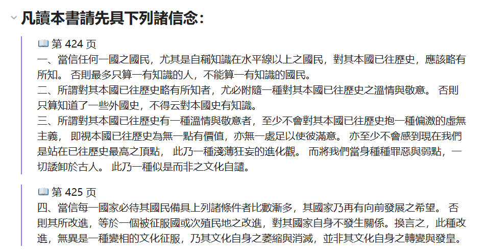
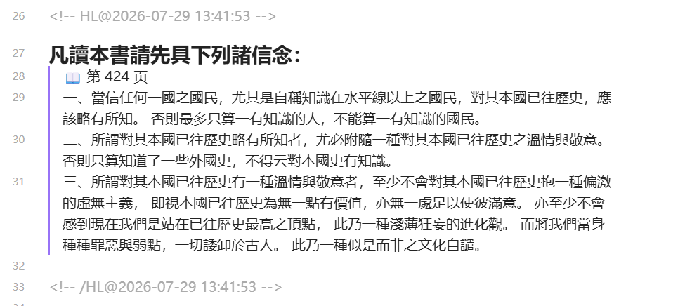

# KOreader FNS Sync Plugin

English | [中文](./README.md)

Sync highlights and notes out of KOreader — **two switchable modes**: sync to Obsidian via the [Fast Note Sync](https://github.com/haierkeys/fast-note-sync-service) service, or write **device-local Markdown with no server at all**. Ships with an independent **AI Reading Assistant** module — either module can be used on its own.

## Features

### 📝 Note Sync (FNS Sync module — lives under Settings ▸ Network)

- 🏠 **Offline local mode** (default, zero config): leave "FNS Server Mode" unchecked — highlights/AI answers are written straight to `FNS-Notes/` Markdown files on the device; plug in USB to read them
- 🔌 **FNS server mode** (optional): check the mode switch, fill in service settings, sync to Obsidian (built on the [fast-note-sync-service](https://github.com/haierkeys/fast-note-sync-service) REST API)
- ✨ **Auto-sync** (triggered on highlight/note edits and book close, debounced; works in both modes)
- 📦 **Offline queue** (FNS mode: queued while offline, auto-pushed once reconnected; retry + freeze-on-failure)
- 🔄 **Bidirectional cross-device sync** (FNS mode, experimental: three-way merge — deleting an HL@ block in Obsidian deletes the highlight across devices)
- 🌱 **Seed migration**: notes created in offline mode are uploaded as the seed on your first FNS sync after configuring a server
- 📝 **Item-level HL@ marker** (your interleaved edits in Obsidian are preserved)
- 🎨 **Customizable templates** (excerpt / note / filename templates, color emoji)
- 📚 **Per-book title/author overrides** (useful for anthologies)

### 🤖 AI Reading Assistant (independent module — top of the Tools tab, fully decoupled from FNS)

- Long-press **Ask AI** on selected text; multi-turn chat via DeepSeek or any OpenAI-compatible API
- Quick buttons: translate / explain / comment / summarize (prompts customizable)
- One tap adds the **Q&A pair to your note** right under the excerpt; cascade-deleted along with it
- Want AI without any sync? Totally fine — the two modules don't depend on each other

### 🖥️ Desktop-side configuration (edit one file over USB)

API keys too long for the on-device keyboard? Edit `koreader/settings/fns_sync.conf` over USB (plain `key = value` lines, effective on KOreader restart) — only the keys you write are updated, everything else stays untouched.

## Installation

1. Download the [latest release](https://github.com/xzymoon/KOreader-FNS-plugin/releases) or clone this repo
2. Copy the entire `plugin/fns_sync.koplugin/` directory into KOreader's `plugins/` folder:
   - **Kindle**: USB-connect, then copy to `<KINDLE>:/koreader/plugins/fns_sync.koplugin/`
   - **Other devices** (Android / Desktop / etc.): see the KOReader docs for the plugin path
3. (Optional, recommended) Copy `extras/reader_menu_order.lua` to `<KINDLE>:/koreader/settings/` — pins "AI Reading Assistant" to the **top** of the Tools tab (without it the entry sits at the tab's end; functionality is unaffected)
4. Restart KOreader

## Menu Structure

Two independent entries (`[✓]` = on, `[ ]` = off):

**FNS Sync** — under Settings ▸ Network. The first item is the **mode switch**; which section you see depends on its state (back out and re-enter the submenu after toggling):

```
FNS Sync (Settings ▸ Network)
├─ [ ] FNS Server Mode         ← mode switch: checked = FNS server, unchecked = local
│
├─ ── shown in LOCAL mode (default) ──
│   ├─ [✓] Auto-write Local Notes
│   ├─ Write Timing
│   │   ├─ [✓] On Highlight Edit
│   │   ├─ [ ] On Book Close
│   │   └─ Write Delay (seconds)
│   ├─ Local Notes Location
│   ├─ Sync to Local Notes (manual)
│   └─ View This Book's Local Note
│
├─ ── shown in FNS SERVER mode ──
│   ├─ Service Settings
│   │   ├─ FNS URL / API Token / Vault
│   │   └─ Test Connection
│   ├─ Sync Current Book Now
│   ├─ Auto Sync
│   │   ├─ [✓] Enable Auto Sync
│   │   ├─ [✓] On Highlight Edit / [ ] On Book Close
│   │   ├─ Sync Delay (seconds)
│   │   └─ Bidirectional Sync (experimental)
│   │       ├─ [ ] Enable / [ ] Auto-pull on Book Open
│   │       └─ Notes
│   ├─ Pull Remote Highlights Now
│   └─ Offline Queue
│       ├─ [✓] Enable Offline Queue
│       ├─ Pending Queue (N books) / Retry Frozen / Clear Queue
│
├─ ── shared by both modes ──
│   ├─ Current Book Info (📁 file / 📖 title / ✍️ author / 🔄 reset)
│   ├─ Note Organization (path prefix / filename template / note template)
│   ├─ Excerpt Rendering (page no. / note marker / chapter / color emoji / template)
│   └─ Advanced (Reset Config / About)
```

**AI Reading Assistant** — its own entry in the Tools tab:

```
AI Reading Assistant (Tools tab)
├─ [✓] Enable AI Chat
├─ API Settings (URL / API Key / Model)
├─ Prompt Templates (system / translate / explain / comment / summarize)
├─ Advanced (max_tokens / temperature / timeout)
└─ Notes
```

## Configuration

### Option 1: edit the conf file on your PC (recommended for long values like API keys)

1. USB-connect, edit `<KINDLE>:/koreader/settings/fns_sync.conf` (a commented template is auto-generated on first launch)
2. Uncomment the lines you need and fill in your values, e.g.:
   ```
   ai_enabled = true
   ai_api_base = https://api.deepseek.com
   ai_api_key = sk-xxxxxxxxxxxxxxxx
   ai_model = deepseek-chat
   ```
3. Save as UTF-8 (no BOM), unplug, restart KOReader — only the keys present in the conf are updated; later menu edits are never clobbered by an unchanged conf (content-fingerprint mechanism)

### Option 2: FNS server mode

1. Open **Settings ▸ Network ▸ FNS Sync**, check **FNS Server Mode** (you'll get a hint if service settings are incomplete)
2. Under **Service Settings**, fill in:
   - **FNS Service URL** (e.g. `https://fns.example.com:9000`)
   - **API Token** (created in the FNS WebGUI)
   - **Vault name**
3. **Test Connection**, then **Sync Current Book Now**

### Option 3: AI Reading Assistant

1. Prepare any **OpenAI-compatible API** (default: [DeepSeek](https://platform.deepseek.com))
2. Open **Tools ▸ AI Reading Assistant ▸ API Settings**, fill in URL / Key / Model (or use the conf file, see Option 1)
3. Check **Enable AI Chat**

Usage: select text while reading → long-press **Ask AI** → type a question (or tap translate/explain/comment) → in the answer window you can keep asking, summarize, or **Add to Note** (written to Obsidian in FNS mode, or to local FNS-Notes/ in offline mode; deleted together with its excerpt).

### Bidirectional sync (FNS mode, experimental)

Enable under **Auto Sync ▸ Bidirectional Sync (experimental)**. Deleting an HL@ block in Obsidian deletes the highlight across devices; highlights created on other devices are pulled back automatically; each highlight additionally stores XPointer coordinates in the note (first-enable privacy confirmation). EPUB/MOBI/AZW3/FB2/TXT/HTML only (crengine formats) — PDF does not support pull.

## End-to-end Example

KOreader highlights are wrapped into HL@ blocks on the Obsidian side.

**Reading view** — what you actually see:



**Source view** — HL@ markers and block structure clearly visible:



The areas between blocks are **safe edit zones** — your own notes there (like the non-highlighted text above) are preserved on every sync. The **inside** of an HL@ block gets overwritten, so don't edit there. Details in [plugin/fns_sync.koplugin/README.md](./plugin/fns_sync.koplugin/README.md).

## Docs

Full usage docs (HL@ block structure, Obsidian safe edit zones, template customization, troubleshooting):
👉 [plugin/fns_sync.koplugin/README.md](./plugin/fns_sync.koplugin/README.md)

## Requirements

- KOreader (developed against master; needs the `onNetworkConnected` event)
- **Offline local mode**: no server needed — install and go
- **FNS server mode** (optional): a deployed [fast-note-sync-service](https://github.com/haierkeys/fast-note-sync-service) instance (REST API + WebGUI)
- **AI Reading Assistant** (optional): any OpenAI-compatible API (default DeepSeek)

## Privacy

Queue data (book path + title) is stored in the `fns_sync_queue` field of KOreader's global `settings.reader.lua`; **not-yet-synced AI answers** in `fns_sync_pending_ai` (answer text + model name). **No FNS tokens or other credentials.** To opt out of the offline queue: **FNS Sync (FNS mode) ▸ Offline Queue ▸ Enable Offline Queue** off.

⚠️ **AI API keys are stored in plaintext** in `settings.reader.lua` (same trust level as the FNS api_token). KOreader's config is plaintext on-device; encryption would only guard against USB snooping, not a lost device — revoke your key at the provider's console if the device is lost. Same applies to `fns_sync.conf`. Bidirectional sync additionally records per-highlight XPointer coordinates in notes (reading progress can be inferred) — be aware with shared vaults.

## Feedback & Contributions

- Server-side issues: [haierkeys/fast-note-sync-service](https://github.com/haierkeys/fast-note-sync-service)
- This plugin: open an issue / PR

## Sponsor

If this plugin helps you, consider buying the author a coffee:

<p align="center">
  
</p>

## License

[AGPL-3.0](./LICENSE), same as KOreader itself. You are free to use, modify, and distribute it (including commercially), provided modified versions are released under the same license.
